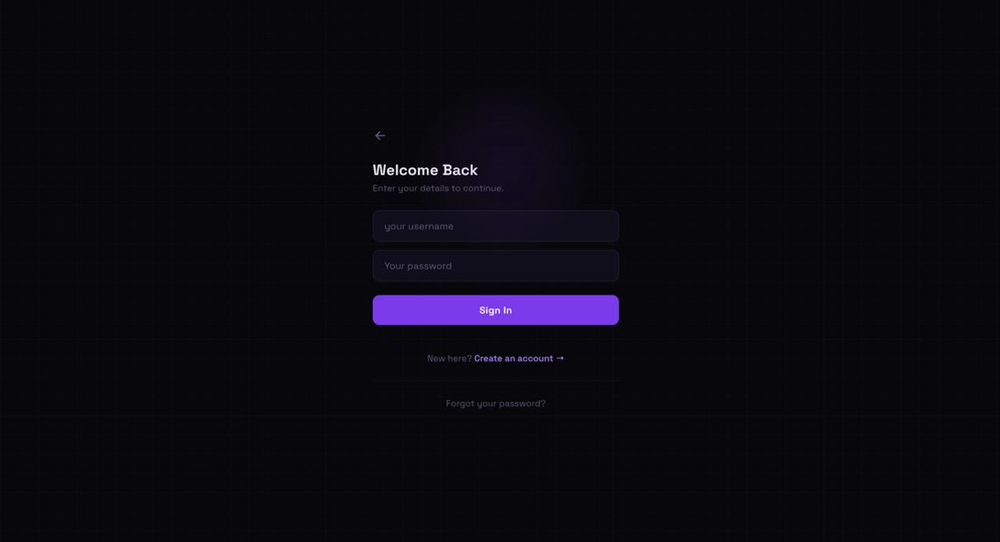
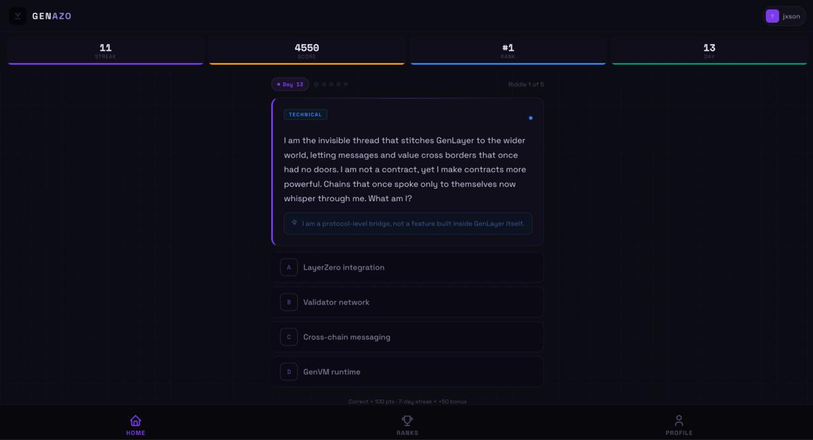
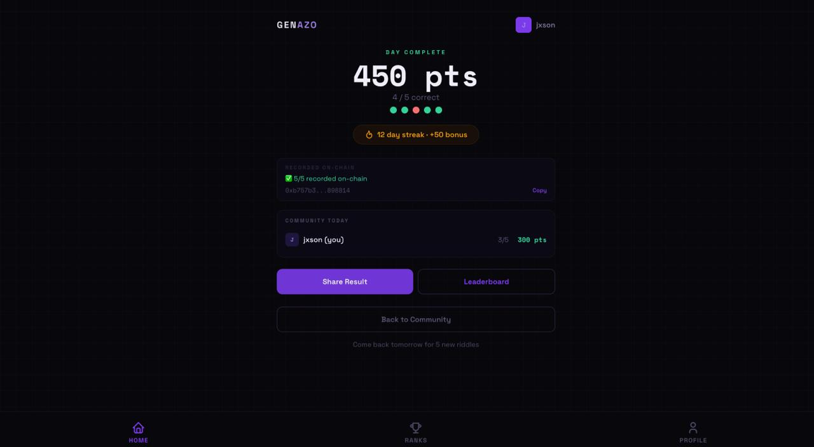

# Genazo 

Genazo is a daily on-chain riddle game built on GenLayer Intelligent Contracts.
It transforms GenLayer documentation into daily riddles that are generated, verified, and scored entirely on-chain. Players solve these riddles to earn points, build streaks, and compete on leaderboards, with every part of the game loop handled autonomously by Intelligent Contracts.

There is no backend logic, no manually written questions, and no human grading — everything from riddle generation to answer verification and scoring is executed on-chain.

**Live Demo:** https://www.genazo.xyz · **Network:** GenLayer Studionet

# The Vision

Genazo explores whether knowledge games can operate autonomously on-chain.

Instead of humans creating content, grading answers, and managing progression systems, Genazo uses GenLayer Intelligent Contracts to generate daily riddles from documentation, evaluate responses, and maintain player progress autonomously.

The project demonstrates how Intelligent Contracts can power educational and knowledge-based applications without centralized control.

# Technical Pillars

**Autonomous Knowledge Generation** Every day, Genazo generates five new riddles directly from GenLayer documentation. Questions are not manually written, curated, or stored in a traditional database.

**Equivalence Principle** Genazo uses GenLayer’s Equivalence Principle to reach validator agreement on documentation retrieval and riddle generation despite non-deterministic outputs.

**Autonomous Verification** Player answers are evaluated on-chain by Intelligent Contracts, with points, streaks, and leaderboard rankings updated automatically.

**Persistent On-Chain State** Player profiles, daily riddles, answers, streaks, points, and leaderboards are stored directly in contract state.

**Zero Human Moderation** No riddles are manually authored. Daily content is generated directly from GenLayer documentation through Intelligent Contracts.

No administrator reviews answers, updates scores, or manages leaderboards.

# Why It Matters

Most educational platforms rely on centralized databases, manually created content, and trusted operators.

Genazo demonstrates how GenLayer Intelligent Contracts can autonomously generate knowledge-based content, evaluate responses, maintain progression systems, and store persistent state entirely on-chain.

While presented as a game, Genazo is ultimately a proof of concept for autonomous educational applications built on GenLayer.

## What It Does

- 5 new riddles about GenLayer drop on-chain every day
- GenLayer Intelligent Contracts generate the questions directly from GenLayer documentation
- Players answer, earn points, and build streaks — all tracked on-chain
- The same Intelligent Contract that generates riddles verifies your answers
- No human is involved at any stage — not even the developer

---

## Quick Demo

git clone https://github.com/jason4185/genazo
cd genazo/frontend
npm install
npm run dev

Visit http://localhost:3000 · No wallet needed · Just a username and password

---

## UI Tour

### Landing Screen

Clean entry point. Username and password only. No MetaMask popup. No seed phrase anxiety. Your identity is a SHA-256 hash of your credentials — derived on-chain, never stored anywhere.

### Riddle Screen

One riddle at a time. Four options. A subtle hint if you need it. Your answer submits to the blockchain in the background while you see instant feedback on screen.

### Result Screen

Correct answer revealed immediately. The explanation was written by a GenLayer Intelligent Contract — not a human. Every result is verifiable on-chain.

---

## How It Works

1. GitHub Actions triggers at midnight UTC — calls the funded wallet script
2. Script calls generate_daily_riddle() — once per riddle, up to 5 times
3. Contract fetches GenLayer docs — via gl.nondet.web.render() from the knowledge page
4. GenLayer Intelligent Contract generates the riddle — gl.nondet.exec_prompt() with topic forcing
5. Validators reach consensus — gl.eq_principle.prompt_comparative confirms equivalence
6. Script calls mark_generation_complete() — signals frontend riddles are ready
7. Player answers — submit_daily_answer() checks correct letter instantly
8. Leaderboard updates — partial update after every answer, full update when day is complete

---

## Contract Address

| Contract | Address | Network |
|----------|---------|---------|
| Genazo.py | 0xf6D5Eb24b26F11c174dd852A65C33A1F99A90D9b | GenLayer Studionet |

---

## Project Structure

genazo/
├── contract/
│   └── Genazo.py
├── frontend/
│   └── main.js
├── scripts/
│   └── daily-riddle.js
├── .github/
│   └── workflows/
│       └── daily-riddle.yml
├── screenshots/
├── SKILL.md
└── README.md

---

## GenLayer Methods Used

| Method | Where | What It Does |
|--------|-------|--------------|
| gl.nondet.web.render() | generate_daily_riddle | Fetches plain text from the knowledge page |
| gl.nondet.exec_prompt() | generate_daily_riddle | Generates riddle JSON with topic forcing |
| gl.eq_principle.prompt_comparative | generate_daily_riddle | Consensus on docs fetch and riddle generation |
| @gl.public.write | register_player, generate_daily_riddle, submit_daily_answer, mark_generation_complete | All state-changing operations |
| @gl.public.view | get_daily_riddle, get_player, get_player_answers, get_leaderboards, get_day_number, get_generation_status | All read operations |
| str storage | All state variables | Player data, riddles, answers, leaderboards stored as JSON strings |

---

## MVP Roadmap

### MVP 1 — Current
- [x] Daily riddle generation via GitHub Actions
- [x] GenLayer Intelligent Contract answer verification
- [x] Streak and points system
- [x] All Time and Weekly leaderboards
- [x] Cross-device sync
- [x] Transaction hash as proof
- [x] Password-based identity — no wallet required

### MVP 2 — Planned
- [ ] MetaMask wallet integration for on-chain identity
- [ ] Increase riddles per day from 5 to 10
- [ ] Move to GenLayer Bradbury testnet

---

## Prerequisites

Node.js 20+
No wallet needed

---

*P.S. Every riddle in this game was written by a GenLayer Intelligent Contract, verified by a GenLayer Intelligent Contract, and judged by a GenLayer Intelligent Contract. The developer has not written a single question. That is the whole point.*

---

**Built by Jason · Submitted to the GenLayer Builder Program**
